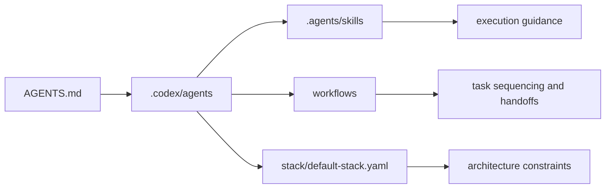

# Multi-Agent Fullstack Template


> Copy-ready Codex subagents, skills, workflows, and project `AGENTS.md` templates for a FastAPI + Vue/Nuxt fullstack stack.

This repository packages a reusable multi-agent setup for projects that want:
- official Codex subagents in `.codex/agents/`
- official Codex skills in `.agents/skills/`
- a clear architectural contract in `stack/default-stack.yaml`
- repeatable multi-agent sequencing through `workflows/`
- project-level `AGENTS.md` templates for fullstack, backend-only, and frontend-only installs

## TL;DR

Use one of these:
- Fullstack project: copy `.codex/`, `.agents/`, `stack/`, `workflows/`, and `templates/project-AGENTS.md`
- Backend-only project: use the `backend-only` install commands in [QUICKSTART.md](QUICKSTART.md)
- Frontend-only project: use the `frontend-only` install commands in [QUICKSTART.md](QUICKSTART.md)
- Browser automation: install `agent-browser` separately if you want browser-driven verification

## What You Get

| Layer | Purpose |
| --- | --- |
| `.codex/agents/` | Canonical Codex subagents for orchestration, implementation, debugging, migrations, contracts, release work, and review |
| `.agents/skills/` | Reusable skill packs for backend, frontend, debugging, decomposition, and browser automation |
| `templates/` | Copy-ready `AGENTS.md` files for target projects |
| `workflows/` | Default multi-agent execution flows for features, bugfixes, and refactors |
| `stack/default-stack.yaml` | Explicit backend and frontend architecture contract |
| `prompts/common/` | Shared prompt constraints used by the subagents |

## Install Modes

| Mode | Best for | What to install |
| --- | --- | --- |
| Full project install | Fullstack repos that want the whole setup | `.codex/`, `.agents/`, `stack/`, `workflows/`, and `AGENTS.md` |
| Backend-only install | API or service repos | Backend-focused agents, backend skills, `stack/`, and backend `AGENTS.md` |
| Frontend-only install | UI repos | Frontend-focused agents, frontend skills, `stack/`, and frontend `AGENTS.md` |
| Global skills install | Reusing the skills outside one project | Copy `.agents/skills/*` into `$HOME/.agents/skills/` |

Primary full install:

```sh
cp -R .codex .agents stack workflows /absolute/path/to/your-project/
cp templates/project-AGENTS.md /absolute/path/to/your-project/AGENTS.md
```

For `backend-only`, `frontend-only`, and global install commands, see [QUICKSTART.md](QUICKSTART.md).

## How It Fits Together



## Repository Layout

```text
AGENTS.md                    # repository maintenance instructions for this template repo
.codex/
  config.toml
  agents/                    # canonical Codex subagents
.agents/
  skills/                    # official Codex skills
prompts/
  common/                    # shared prompt constraints
stack/
  default-stack.yaml         # architecture contract
templates/
  project-AGENTS.md
  project-AGENTS.backend.md
  project-AGENTS.frontend.md
workflows/                   # sequencing and handoff contracts
```

## Agent Catalog

| Agent | Owns | Use when |
| --- | --- | --- |
| `tech_lead_orchestrator` | task decomposition, ownership, sequencing | the task spans multiple files, layers, or specialists |
| `backend_implementer` | FastAPI, services, repositories, DTOs, exceptions, logging, UoW | backend behavior changes |
| `frontend_ui_implementer` | Vue/Nuxt presentation, layout, styling, accessibility | the work is primarily visual or interaction-heavy |
| `frontend_data_validation_implementer` | typed API access, async-data, Pinia, forms, validation | the work is primarily client logic or data flow |
| `frontend_implementer` | tightly coupled mixed frontend work | the task is too small or coupled to split safely |
| `integration_contract_keeper` | DTO, OpenAPI, and frontend-consumer alignment | request or response contracts change |
| `db_migration_owner` | schema change planning, Alembic, rollback | persistence shape changes |
| `devops_release_owner` | CI, deployment, rollout, rollback, observability | release or infra concerns are involved |
| `qa_debugger` | reproduction, failing paths, regression checks, browser verification | you need to debug or verify behavior |
| `reviewer_guard` | final review, risk analysis, missing tests | you want a final read-only review |

## How To Choose An Agent

| If the task is mostly about... | Start with... |
| --- | --- |
| multi-step planning across layers | `tech_lead_orchestrator` |
| FastAPI/backend implementation | `backend_implementer` |
| Vue/Nuxt UI, layout, styling, accessibility | `frontend_ui_implementer` |
| frontend data flow, forms, Pinia, validation | `frontend_data_validation_implementer` |
| mixed but small frontend changes | `frontend_implementer` |
| API contract drift or DTO sync | `integration_contract_keeper` |
| schema changes or Alembic | `db_migration_owner` |
| reproduction, failing paths, browser checks | `qa_debugger` |
| final review and regression risk | `reviewer_guard` |

## Workflow Catalog

| Workflow | Goal | Typical use |
| --- | --- | --- |
| `feature-delivery` | deliver a feature with explicit ownership and review | cross-layer feature work |
| `bugfix` | reproduce first, then isolate and verify the fix | correctness or regression issues |
| `refactor` | reshape code without changing intended behavior | structural cleanup with invariant preservation |

Workflows are sequencing and handoff contracts, not role definitions.

## Prompt Starters

Use these from a target project that already contains the installed template.

<details>
<summary>Backend Feature</summary>

```text
Spawn subagents for this backend task.
Use tech_lead_orchestrator to decompose the work first.
Then use backend_implementer for implementation and reviewer_guard for the final review.
Wait for all subagents and return one consolidated summary with changed files, tests run, and open risks.
Task: <describe the backend feature here>
```

</details>

<details>
<summary>Frontend UI Work</summary>

```text
Spawn subagents for this frontend UI task.
Use frontend_ui_implementer for Vue component composition, Nuxt page or layout presentation, styling, responsiveness, and accessibility work.
Use reviewer_guard for the final review.
Wait for both subagents and summarize changed files, UI notes, tests, and residual risks.
Task: <describe the UI change here>
```

</details>

<details>
<summary>Frontend Data And Validation Work</summary>

```text
Spawn subagents for this frontend client-logic task.
Use frontend_data_validation_implementer for typed API access, Nuxt async-data flows, Pinia state, and schema-driven validation changes.
Use integration_contract_keeper if request or response contracts might change.
Use reviewer_guard for the final review.
Wait for all results and summarize changed files, client-logic notes, tests, and residual risks.
Task: <describe the client behavior change here>
```

</details>

<details>
<summary>Bugfix And Reproduction</summary>

```text
Spawn subagents for this bugfix.
Use qa_debugger to reproduce the issue and identify the failing path.
Use backend_implementer for backend fixes.
Use frontend_ui_implementer for presentation-heavy frontend fixes.
Use frontend_data_validation_implementer for client data, async-data, store, form, or validation fixes.
Use frontend_implementer only when the frontend fix is too small or too coupled to split.
Use reviewer_guard for a final regression review.
Wait for all results and summarize root cause, fix, tests, and residual risks.
Bug: <describe the bug here>
```

</details>

<details>
<summary>Browser Reproduction Or UI Verification</summary>

```text
Spawn subagents for this browser-heavy task.
Use tech_lead_orchestrator to decide whether the work belongs to QA, frontend, or both.
Use qa_debugger for agent-browser-based reproduction, screenshots, login handling, downloads, scraping, and verification.
Use frontend_ui_implementer for presentation-heavy app changes discovered during browser verification.
Use frontend_data_validation_implementer for client data, async-data, store, form, or validation fixes discovered during browser verification.
Use frontend_implementer only if the frontend change is too small or too coupled to split.
Wait for all results and summarize browser steps, artifacts, code changes, and residual risks.
Task: <describe the browser flow or website here>
```

</details>

<details>
<summary>Database Migration</summary>

```text
Spawn subagents for this schema change.
Use db_migration_owner for the migration plan and migration changes.
Use backend_implementer to update repositories, DTOs, services, and controllers affected by the schema change.
Use reviewer_guard for a final migration and rollback review.
Wait for all subagents and summarize migration steps, compatibility risks, rollback plan, and tests.
Task: <describe the schema or data change here>
```

</details>

<details>
<summary>Fullstack Feature</summary>

```text
Spawn subagents for this fullstack feature.
Use tech_lead_orchestrator to break the task into backend, frontend UI, frontend data and validation, and contract work.
Use integration_contract_keeper for API and DTO contract alignment.
Use backend_implementer for backend changes.
Use frontend_ui_implementer for presentation-heavy frontend changes.
Use frontend_data_validation_implementer for async-data, store, form, and validation-heavy frontend changes.
Use frontend_implementer only when frontend work is too small or too coupled to split safely.
Use reviewer_guard for the final review.
Wait for all subagents and return one integrated summary with changed files, contract changes, tests run, and open risks.
Task: <describe the feature here>
```

</details>

<details>
<summary>Code Review</summary>

```text
Spawn subagents for a review of the current branch against main.
Use reviewer_guard for the main review.
Use qa_debugger to inspect test gaps and flaky behavior.
Wait for both subagents and summarize findings by severity, then list missing tests and rollout risks.
```

</details>

## Default Stack

### Backend

| Concern | Default |
| --- | --- |
| Framework | `FastAPI` |
| ORM | `SQLAlchemy 2.x` |
| DI | `Dishka` |
| Migrations | `Alembic` |
| Architecture | controller -> service -> unit of work -> repositories |
| Boundaries | dedicated DTO layer, explicit exceptions, structured logging |

Backend rules:
- controllers translate HTTP only and call services
- services own use-case orchestration and transaction boundaries
- repositories stay behind the unit of work
- DTOs stay separate from ORM and transport types
- exceptions and logging stay explicit and structured

### Frontend

| Concern | Default |
| --- | --- |
| Framework | `Vue 3 + TypeScript` |
| App layer | `Nuxt 3` |
| Shared state | `Pinia` |
| Data flow | typed API clients plus `useFetch` and `useAsyncData` through composables |
| Forms | composable-first with schema-driven validation |

Frontend rules:
- keep Nuxt pages and layouts thin
- move reusable behavior into composables and shared components
- keep typed API access in dedicated data-access seams
- use `Pinia` only when state truly crosses routes or features
- keep forms schema-driven and backend error mapping explicit

The canonical stack contract lives in [`stack/default-stack.yaml`](stack/default-stack.yaml).

## Skill Packs

Backend-oriented skills:
- `backend-structure`
- `backend-feature`
- `fastapi-controllers`
- `dishka-di`
- `service-layer`
- `sqlalchemy-repositories`
- `unit-of-work`
- `backend-dtos`
- `backend-exceptions`
- `backend-logging`
- `db-migration`
- `api-contracts`

Frontend-oriented skills:
- `frontend-structure`
- `frontend-feature`
- `vue`
- `nuxt`
- `pinia`
- `web-design-guidelines`
- `frontend-data-access`
- `frontend-forms-and-validation`

Cross-cutting skills:
- `repo-intake`
- `task-decomposition`
- `code-review`
- `test-debug`
- `agent-browser`

Frontend skill source:
- the frontend skills are taken from [`antfu/skills`](https://github.com/antfu/skills)
- they are then adapted locally to fit this repository's ownership boundaries and workflows

## Project Templates

Copy-ready project instruction files:
- `templates/project-AGENTS.md` for fullstack installs
- `templates/project-AGENTS.backend.md` for backend-only installs
- `templates/project-AGENTS.frontend.md` for frontend-only installs

## Design Principles

- `.codex/agents/` and `.agents/skills/` are the canonical Codex layer in this template
- skills should stay small and composable
- workflows describe sequencing and handoffs, not tool implementation details
- stack-specific constraints belong in prompts and stack manifests, not duplicated everywhere
- frontend specialist agents should not edit the same files in parallel without explicit ownership

## Reuse Modes

- `Project-scoped Codex`: copy `.codex/`, `.agents/`, `stack/`, `workflows/`, and a project `AGENTS.md` template into a target repository
- `Partial install`: use the `backend-only` or `frontend-only` commands in [`QUICKSTART.md`](QUICKSTART.md) when the target project does not need the full role set
- `User-scoped Codex`: optionally copy `.agents/skills/*` into `$HOME/.agents/skills/`

## Current Contents

This repository currently contains:
- official Codex subagents in `.codex/agents/*.toml`
- official Codex skill directories in `.agents/skills/*`
- copy-ready project `AGENTS.md` templates
- shared workflows and prompt layers
- a stack-aware architecture contract
